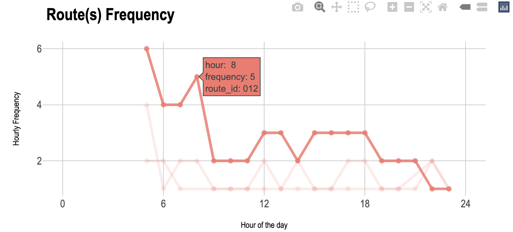
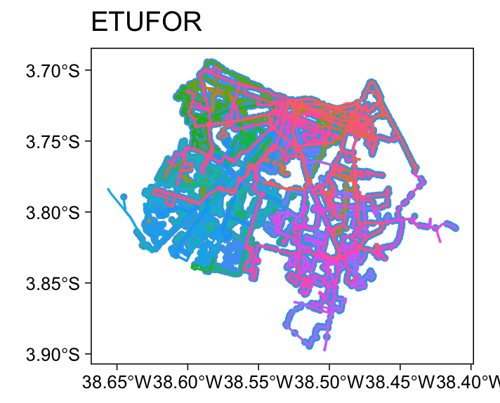

# GTFSwizard 
[](https://lifecycle.r-lib.org/articles/stages.html)

GTFSwizard is a set of tools for exploring and manipulating [General Transit Feed Specification (GTFS)](https://gtfs.org/) files in R.

Its main purpose is to provide researchers and practitioners with a seamless and easy way to visually explore and simulate changes within a GTFS file, which represent public transportation schedules and geographic data. The package allows users to filter data by routes, trips, stops, and time, generate spatial visualizations, and perform detailed analyses of transit networks, including headway, dwell times, and route frequencies.

## Installation
``` r
> install.packages('remotes') # if not already installed
# wait for the installation to complete

> remotes::install_github('OPATP/GTFSwizard')
```
## Cheat Sheet
_under development..._

## Basics
GTFS feeds are read using the `read_gtfs()` function. `read_gtfs()` returns a `wizardgtfs` object, which is a slightly improved `gtfs` object. You can also convert a regular `gtfs` object to a `wizardgtfs` object using the `as_wizardgtfs()` function. You can take a glance at the feed using the `summary()` function.
``` r
> library(GTFSwizard)

> gtfs <- read_gtfs('path-to-gtfs.zip') # or
> gtfs <- as_wizardgtfs(gtfs_obj)

> names(gtfs)
# [1] "agency"          "calendar"
# [3] "calendar_dates"  "fare_attributes"
# [5] "fare_rules"      "routes"
# [7] "shapes"          "stop_times"
# [9] "stops"           "trips"
# [11] "dates_services"

> class(gtfs)
# [1] "wizardgtfs" "gtfs" "list"

> summary(gtfs)
#A wizardgtfs object with:  

#10  GTFS tables 
#With the following names and respective numbers of entries in each: 
#         agency        calendar  calendar_dates fare_attributes 
#              1               3               6               2 
#     fare_rules          routes          shapes      stop_times 
#            345             345          125776         2659737 
#          stops           trips 
#           4676           85410 
#345  routes 
#4676  stops 
#85410  trips 
#823  valid days of service 
#271.4  meters is the average distance between sequencial stops in a given route 
```

GTFS feeds are explored using the `explore_gtfs()` function:
``` r
> explore_gtfs(for_gtfs)
```

</a>

## Service Patterns
The concept of a `service_pattern` in **GTFSwizard** helps to address a common limitation of GTFS: its lack of a standardized way to distinguish distinct service patterns within the same route. GTFS files can have multiple `service_ids` for trips within the same route on the same day, such as regular and extra services. However, GTFS does not inherently identify unique service patterns, _i.e._ unique set of `service_id`s.

In `wizardgtfs` objects, the `dates_services` table is an extended feature that consolidates dates and associated `service_id`s into a single, organized table. This table is not standard in typical GTFS files but is added specifically in `wizardgtfs` objects. The `dates_services` table is structured so that each date is associated with a `list` of `service_id`s representing the transit services operating on that specific day. Essentially, every unique `list` of `service_id`s observed across dates defines a distinct `service pattern`.

- Structure of `dates_services`: Each date in the `dates_service`s table has an associated `list` of `service_id`s, capturing the set of services active on that particular day.

- Defining Service Patterns: A unique `service_pattern` is identified by a unique combination of `service_id`s operating on a given date. For instance, if two dates share the exact same `service_id`s, they are considered part of the same `service_pattern`.

``` r
> GTFSwizard::get_servicepattern(for_gtfs)
## A tibble: 3 × 3
#  service_id service_pattern  pattern_frequency
#  <chr>      <fct>                        <int>
#1 U          servicepattern-1                65
#2 S          servicepattern-2                13
#3 D          servicepattern-3                13
```

Most of the functions will consider service_patterns, _e.g._ `get_frequency()` and `plot_routefrequency()`.

```r
> GTFSwizard::get_frequency(for_gtfs)
## A tibble: 667 × 4
#   route_id daily.frequency service_pattern  pattern_frequency
#   <chr>              <int> <fct>                        <int>
# 1 004                   66 servicepattern-1                65
# 2 011                   53 servicepattern-1                65
# 3 011                   30 servicepattern-2                13
# 4 011                   17 servicepattern-3                13
# 5 012                   53 servicepattern-1                65
# 6 012                   28 servicepattern-2                13
# 7 012                   20 servicepattern-3                13
# 8 014                   30 servicepattern-1                65
# 9 014                   19 servicepattern-2                13
#10 014                   19 servicepattern-3                13
## ℹ 657 more rows
## ℹ Use `print(n = ...)` to see more rows
```

</a>

You can use `plot_calendar()` to check the numer of trips along the calendar and get a better sense of the `service_pattern` logic.

``` r
> GTFSwizard::plot_calendar(for_gtfs)
```

</a>

# Exploring
Routes, frequency, headways, dell times, speeds, shapes, stops, are calculated using the `get_frequency()`, the `get_headways()`, the `get_dwelltimes()`, and the `get_speed()` functions:
``` r
> get_headways(gtfs, simplify = TRUE)

```

GTFSwizard reconstructs missing shape tables using the `get_shapes()` function. Variations of this function can create `simple feature` objects from `stops` or `shapes` tables, using `get_stops_sf()` or `get_shapes_sf()` functions, or even standard GTFS `shapes` data frame from `simple feature` shapes object, using `get_shapes_df()` function.

``` r
> gtfs$shapes
#NULL

> gtfs <- GTFSwizard::get_shapes(gtfs)

> gtfs$shapes
## A tibble: 6,830 × 5
#   shape_id shape_pt_lon shape_pt_lat shape_pt_sequence shape_dist_traveled
#   <chr>           <dbl>        <dbl>             <int>               <dbl>
# 1 shape-1         -38.7        -3.96                 1                  0 
# 2 shape-1         -38.7        -3.95                 2                499.
# 3 shape-1         -38.7        -3.96                 3               1428 
# 4 shape-1         -38.7        -3.98                 4               3404.
# 5 shape-1         -38.7        -3.97                 5               5490.
# 6 shape-1         -38.7        -3.97                 6               6248.
# 7 shape-1         -38.7        -3.98                 7               7871.
# 8 shape-1         -38.8        -3.97                 8              11398.
# 9 shape-1         -38.7        -3.97                 9              13093.
#10 shape-1         -38.8        -3.97                10              13395 
## ℹ 6,820 more rows
## ℹ Use `print(n = ...)` to see more rows

> GTFSwizard::get_shapes_sf(for_gtfs$shapes)
#Simple feature collection with 509 features and 2 fields
#Geometry type: LINESTRING
#Dimension:     XY
#Bounding box:  xmin: -38.65624 ymin: -3.897338 xmax: -38.41016 ymax: -3.694365
#Geodetic CRS:  WGS 84
## A tibble: 509 × 3
#   shape_id   shape_dist_traveled                                                              geometry
#   <chr>                    <dbl>                                                      <LINESTRING [°]>
# 1 shape004-I                   0 (-38.50181 -3.831178, -38.50185 -3.831165, -38.50242 -3.831016, -38.…
# 2 shape004-V                   0 (-38.4845 -3.738462, -38.48455 -3.738554, -38.48457 -3.738583, -38.4…
# 3 shape011-I                   0 (-38.53249 -3.722036, -38.53255 -3.722017, -38.53286 -3.721924, -38.…
# 4 shape012-V                   0 (-38.53251 -3.722151, -38.53242 -3.722182, -38.53195 -3.722339, -38.…
# 5 shape014-V                   0 (-38.53121 -3.757169, -38.53111 -3.757062, -38.53102 -3.756946, -38.…
# 6 shape015-I                   0 (-38.60755 -3.772986, -38.60752 -3.772894, -38.60741 -3.772499, -38.…
# 7 shape015-V                   0 (-38.58454 -3.737546, -38.58455 -3.73752, -38.58455 -3.737483, -38.5…
# 8 shape016-I                   0 (-38.58995 -3.709432, -38.59 -3.709269, -38.59003 -3.70917, -38.5900…
# 9 shape016-V                   0 (-38.48468 -3.738597, -38.48476 -3.738568, -38.48484 -3.738538, -38.…
#10 shape017-I                   0 (-38.47904 -3.796202, -38.47898 -3.796908, -38.47975 -3.796987, -38.…
## ℹ 499 more rows
## ℹ Use `print(n = ...)` to see more rows

> GTFSwizard::get_stops_sf(for_gtfs$stops)
#Simple feature collection with 4793 features and 3 fields
#Geometry type: POINT
#Dimension:     XY
#Bounding box:  xmin: -38.64515 ymin: -3.894503 xmax: -38.4108 ymax: -3.694365
#Geodetic CRS:  WGS 84
## A tibble: 4,793 × 4
#   stop_id stop_name                      wheelchair_boarding              geometry
#   <chr>   <chr>                                        <int>           <POINT [°]>
# 1 10      AVENIDA CEL CARVALHO, 1135                      NA  (-38.5906 -3.702286)
# 2 1000    RUA DOR JOAO MOREIRA, 489                       NA (-38.52899 -3.722157)
# 3 1001    RUA DOR JOAO MOREIRA, 163                       NA (-38.52601 -3.723169)
# 4 1009    AVENIDA TRISTÃO GONÇALVES, 500                  NA (-38.53285 -3.725926)
# 5 1010    AVENIDA IMPERADOR, 550                          NA (-38.53421 -3.726137)
# 6 1013    AVENIDA IMPERADOR, 262                          NA  (-38.53348 -3.72369)
# 7 1014    RUA SAO PAULO, 955                              NA (-38.53403 -3.723879)
# 8 1015    RUA GUILHERME ROCHA, 1048                       NA (-38.53547 -3.724543)
# 9 1016    RUA GAL SAMPAIO, 951                            NA  (-38.53078 -3.72682)
#10 102     RUA BETA, 202                                   NA  (-38.60078 -3.71436)
## ℹ 4,783 more rows
## ℹ Use `print(n = ...)` to see more rows
```

## Objects
GTFS features the `for_data` object, a sample of the real urban regular bus system in the city of Fortaleza, Brazil, on the 2020's.
``` r
> gtfs <- GTFSwizard::for_data

> plot(gtfs)
```
</a>

## Related Packages
GTFSwizard mainly rellies on [dplyr](https://dplyr.tidyverse.org/), [tidytransit](https://cran.r-project.org/web/packages/tidytransit/vignettes/introduction.html) and [gtfsio](https://r-transit.github.io/gtfsio/articles/gtfsio.html) for data wrangling, [leaflet](https://leafletjs.com/) for map rendering, [ggplot2](https://ggplot2.tidyverse.org/) and [plotly](https://plotly.com/r/) for data visualization, and [shiny](https://shiny.posit.co/) for the `explore_gtfs()` application assembling.

## Acknowledgement <a href="https://www.det.ufc.br/petran"></a>
**GTFSwizard** is developed by Nelson Quesado and Caio Guimarães at OPA-TP research group, Universidade Federal do Ceará.
